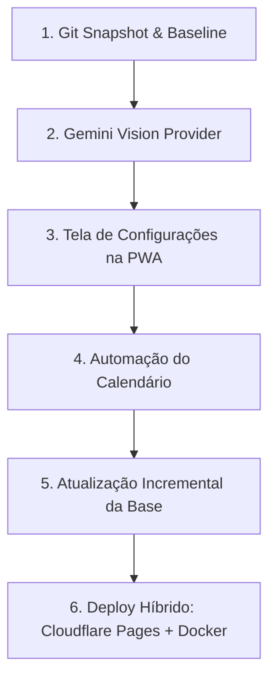

# 024 — Auditoria Técnica de Preparação para Produção e Próximos Passos

**Data de Elaboração:** 2026-09-23  
**Status do Projeto:** Fase 11 concluída | PWA Lotes A–I operacionais | 437/437 testes Python | 76/76 testes Vitest  
**Responsável:** Engenheiro Sênior de Estabilização e Produção  

---

## 1. Estado do Git

### 1.1 Diagnóstico Pré-Commit
Antes desta intervenção, o repositório encontrava-se inicializado na branch `master`, porém em estado **totalmente untracked** (nenhum commit histórico registrado no Git).

```text
On branch master
No commits yet
Untracked files: (184 arquivos presentes no diretório raiz e subpastas)
```

### 1.2 Revisão e Higienização do `.gitignore`
Para garantir a integridade do commit de base e impedir a exposição de dados efêmeros, credenciais ou lixo de compilação, o arquivo `.gitignore` foi auditado e complementado com as seguintes regras explícitas:

* **Arquivos de Execução e Logs Temporários:** inclusão de `*.log`, `*.pid` e `full_suite_output*.txt` (saídas das suítes de teste de 17 minutos geradas nas fases anteriores).
* **Ambiente de Desenvolvimento e Cache:** inclusão de `.claude/` (travas de agendamento local) e validação da exclusão de `.runtime/`, `.pytest_cache/`, `web/node_modules/`, `web/dist/` e `web/.vite/`.
* **Segurança e Segredos:** padronização de exclusão de arquivos de variáveis de ambiente (`.env*`), preservando estritamente o template público `!.env.example`.
* **Preservação de Arquivos Locais:** nenhum arquivo de log ou runtime foi apagado do disco; apenas tiveram seu rastreamento ignorado pelo Git conforme instrução.

---

## 2. Resultado do Primeiro Commit

O primeiro marco seguro do projeto foi registrado com sucesso.

* **Hash do Commit:** `72b2c86`
* **Mensagem:** `chore: baseline Fase 11 + PWA Lote I`
* **Branch:** `master`
* **Volume:** 184 arquivos adicionados, compreendendo todo o ecossistema de código (`src/`, `api/`, `web/`, `scripts/`, `tests/`), a documentação histórica (`docs/001` a `docs/018`), os arquivos de inicialização rápida (`.bat`) e os marcadores de diretório de dados (`data/*/.gitkeep`).
* **Verificação Pós-Commit:**
  ```text
  On branch master
  nothing to commit, working tree clean
  72b2c86 chore: baseline Fase 11 + PWA Lote I
  ```

O repositório agora possui um ponto de restauração confiável e auditável para qualquer evolução futura.

---

## 3. Staleness (Base Histórica)

### 3.1 Ponto de Corte Real (*Cutoff*) e Defasagem
* **Data de corte atual:** `2026-05-25` (conforme registrado em `src/forward/config.py::HISTORICAL_DATA_CUTOFF`, `src/odds/pricing_compare.py` e nos relatórios das Fases 8.1, 9 e 11).
* **Defasagem temporal:** Considerando a data de 23 de setembro de 2026, a base de dados histórica possui **121 dias de defasagem**.

### 3.2 Viabilidade Técnica da Atualização Incremental
* **O script incremental funciona?**  
  **Sim.** O módulo `src/incremental/` e o script `scripts/run_incremental_update.py` estão 100% implementados e testados (21 testes unitários passando em `tests/test_incremental.py`). As etapas de investigação, deduplicação por hash de partida, resolução de novos jogadores (`NEW-<player_id>`), normalização de partidas via `transform_raw_matches` e reconstrução de features Serve × Return estão completas.
* **Existe fonte pública utilizável imediatamente?**  
  **Não.** A auditoria detalhada realizada na Fase 8.1 (`data/raw/incremental_2026/source_investigation.json`) confirmou que:
  1. Os repositórios originais do Jeff Sackmann retornam `HTTP 404` (indisponíveis publicamente).
  2. O mirror público utilizado na Fase 1 (`Aneeshers/tennis-sackmann-archive`) é um snapshot estático e não recebeu novos commits para 2026.
  3. Bases derivadas encontradas no GitHub/Kaggle fornecem apenas colunas básicas de resultado (torneio, placar, vencedor e ranking), **carecendo das 18 colunas de estatísticas de saque e devolução** (`w_ace`, `w_df`, `w_svpt`, `w_1stIn`, `w_1stWon`, `w_2ndWon`, `w_SvGms`, `w_bpSaved`, `w_bpFaced`, etc.).
  4. Sites oficiais (ex.: `atptour.com`) aplicam bloqueios anti-bot agressivos (Akamai `HTTP 403`).
* **Natureza do Bloqueio:**  
  O problema é **estritamente de fonte de dados e proveniência**, e **não técnico**. O motor de ingestão incremental está pronto para processar dados no momento em que uma fonte estruturada com as 18 colunas de estatísticas de saque estiver disponível sem violar termos de uso ou contornar defesas anti-bot. Incorporar fontes parciais (somente placar/ranking) não altera os modelos Serve × Return e geraria poluição no banco sem ganho preditivo.

---

## 4. Gemini Vision (Extração Visual de Odds)

### 4.1 Facilidade de Integração
A adição de um `GeminiVisionProvider` é de **baixa complexidade e baixíssimo risco**. A arquitetura do Lote F em `src/screenshot_parser/` foi concebida sob o princípio de inversão de dependência através do protocolo abstrato `ScreenshotVisionProvider` (`src/screenshot_parser/providers.py`).

### 4.2 Arquivos Necessários para Modificação
1. **[NOVO] `src/screenshot_parser/gemini_provider.py`**:
   - Implementa a interface `ScreenshotVisionProvider`.
   - Utiliza a biblioteca `requests` (já instalada) para chamar a API REST do Google Gemini (`v1beta/models/{model}:generateContent`).
   - Converte a imagem local (`PNG/JPEG/WEBP`) para base64 inline e envia o mesmo prompt estruturado já validado em `anthropic_provider.py`.
   - Mapeia o JSON de resposta para a lista de `RawReading`.
2. **`src/screenshot_parser/config.py`**:
   - Adicionar variáveis: `GEMINI_API_KEY_ENV_VAR = "GEMINI_API_KEY"` e `DEFAULT_GEMINI_MODEL = "gemini-2.5-flash"`.
3. **`src/screenshot_parser/providers.py`**:
   - Na fábrica `get_provider(name)`, adicionar a resolução:
     ```python
     elif resolved == "gemini":
         from .gemini_provider import GeminiVisionProvider
         return GeminiVisionProvider()
     ```
4. **`tests/test_screenshot_parser.py`**:
   - Adicionar testes de unidade simulando a resposta da API do Gemini via `unittest.mock` (sem requisições reais à rede).

### 4.3 Acoplamento com Anthropic
**Inexistente no domínio da aplicação.** Os módulos de validação estrutural (`validator.py`), armazenamento (`storage.py`, `extraction_storage.py`), pareamento de apostas (`mapping.py`) e regras operacionais (`src/odds/screenshot_evaluation.py`) trabalham exclusivamente com as estruturas neutras `RawReading`, `ExtractionResult` e `ExtractionContext`. O código da Anthropic vive isolado em seu próprio arquivo.

### 4.4 Estratégia de Provedores Recomendada
* **Seleção Explícita via Configuração/Ambiente (`TENNIS_RADAR_VISION_PROVIDER`):** Permitir alternar entre `"gemini"` e `"anthropic"`.
* **Sem Fallback Automático Silencioso:** Respeitar a regra de governança do projeto ("falhar cedo e com clareza"). Se o usuário configurar o Gemini e a requisição falhar (ex.: cota ou chave inválida), a API deve responder explicitamente `503 Service Unavailable` ou `504 Gateway Timeout`. Fallbacks automáticos entre provedores comerciais com precificações e latências distintas geram comportamento imprevisível e mascaram falhas de configuração.

---

## 5. Cloudflare Readiness

Avaliação da viabilidade de execução do projeto na infraestrutura da Cloudflare:

| Componente | Classificação | Análise Técnica |
|---|:---:|---|
| **Frontend React 19 / Vite** | ✅ Funciona direto | Hospedagem estática perfeita no **Cloudflare Pages**. Suporta SPA routing via regra de redirect (`/* /index.html 200`). |
| **Service Worker / PWA** | ✅ Funciona direto | Suporte completo a HTTPS nativo, Service Worker (`sw.js`), Web App Manifest e cache offline. |
| **Chamadas HTTP Externas (IA)** | ✅ Funciona direto | Requisições HTTPS para Google Gemini e Anthropic funcionam sem restrição. |
| **Gestão de Segredos** | ✅ Funciona direto | Cloudflare Secrets e variáveis de ambiente configuráveis via painel ou CLI `wrangler`. |
| **Fuso Horário (`zoneinfo`)** | ⚠ Precisa adaptação | Em runtimes serverless reduzidos, a base de dados `tzdata` pode não estar embutida no sistema de arquivos. |
| **Biblioteca `requests`** | ⚠ Precisa adaptação | Em Cloudflare Workers (Pyodide), sockets tradicionais C são restritos; exige uso de clientes assíncronos baseados em `fetch` (ex.: `httpx` com transporte específico). |
| **Processamento de Imagem (`Pillow`)** | ⚠ / ❌ Incompatível em Workers | Depende de bibliotecas nativas de decodificação C (`libjpeg`, `libpng`, `libwebp`), incompatíveis com a sandbox de Workers padrão. |
| **FastAPI (ASGI)** | ⚠ / ❌ Incompatível em Workers | Cloudflare Workers operam sob modelo de invocação de eventos isolados (`fetch(event)`), não em loop contínuo uvicorn/ASGI. |
| **Pacotes Científicos (`pandas`, `scipy`, `sklearn`)** | ❌ Incompatível em Workers | Limite de memória por Worker (128 MB a 512 MB no plano pago) e restrição rigorosa a compilações nativas C/Fortran impedem o carregamento dessas bibliotecas pesadas. |
| **Parquet / Arrow (`pyarrow`, `duckdb`)** | ❌ Incompatível em Workers | Requerem binários C++ pesados e chamadas de sistema não suportadas no ambiente de isolate V8. |
| **Sistema de Arquivos Local Gravável** | ❌ Incompatível em Workers | Workers possuem **sistema de arquivos estritamente efêmero e somente-leitura**. O Tennis Radar grava parquets de forward test, uploads de prints (`data/raw/bookmaker_screenshots`), logs de auditoria e sidecars JSON no disco. |
| **Execução de Processos (`subprocess`)** | ❌ Incompatível em Workers | Proibido no ambiente serverless da Cloudflare. |

### Arquitetura de Produção Viável com Cloudflare
A migração de todo o backend estatístico para Cloudflare Workers exigiria uma reescrita desnecessária e arriscada (substituição de Pandas/Parquet por Cloudflare D1/R2).

A **estratégia ideal e recomendada** é uma arquitetura híbrida:
1. **Frontend:** Hospedado no **Cloudflare Pages** (gratuito, borda global, CDN ultra-rápida, SSL automático).
2. **Backend:** Empacotado em **Container Docker** (FastAPI + Python 3.14 + Pandas + Parquet) hospedado em um provedor com volume persistente (VPS, Railway, Fly.io ou GCP Cloud Run).
3. **Borda e Segurança:** O domínio e o tráfego da API passam pela Cloudflare via **Cloudflare Tunnel (`cloudflared`)** ou Proxy DNS com WAF, garantindo proteção contra ataques sem alterar uma linha de código do backend.

---

## 6. Calendário Automático

### 6.1 O que Falta para Automatizar?
Atualmente, o preenchimento de `data/raw/calendar/agenda_YYYYMMDD.csv` é feito manualmente. Para torná-lo automático, faltam dois componentes:
1. **Conector HTTP Coletor:** Um script/módulo capaz de requisitar a programação diária de jogos a partir de um feed/API aberto.
2. **Normalizador de Nomes de Jogadores:** Mapear as strings de nomes vindas da fonte externa para os nomes canônicos do banco (`src/normalization/players.py` ou `src/radar/identity.py`), garantindo que o `match_key` gerado coincida perfeitamente com os dados do Radar.

### 6.2 Ponto de Entrada na Arquitetura
A arquitetura do Lote C já prevê extensão através da interface `CalendarProvider` (`src/calendar/providers.py`):
* **Opção Arquitetural A (Recomendada):** Criar um script em `scripts/fetch_daily_calendar.py` que consulta a fonte externa e salva o arquivo estruturado `data/raw/calendar/agenda_YYYYMMDD.csv`.
  * *Vantagem:* Mantém o princípio de imutabilidade dos dados brutos em disco, permitindo auditoria visual humana e garantindo que o `ManualFileCalendarProvider` continue lendo os arquivos exatamente como faz hoje, sem risco de regressão.
* **Opção Arquitetural B:** Criar uma classe `HttpCalendarProvider` implementando `CalendarProvider` diretamente em memória.

### 6.3 Dados Mínimos Obrigatórios
Para alimentar o calendário sem quebrar validações (`src/calendar/config.py::REQUIRED_RAW_COLUMNS`):
* `tour` (`ATP` ou `WTA`)
* `tournament` (nome do torneio)
* `round` (fase: `R128`, `R64`, `R32`, `R16`, `QF`, `SF`, `F`)
* `player_a_raw` e `player_b_raw`
* `surface` (`Hard`, `Clay`, `Grass`)
* `event_datetime_original` (horário de agendamento)
* `event_timezone` (identificador IANA válido, ex.: `Europe/Madrid`, `America/New_York`, `UTC`)
* `source_url` (link de proveniência)
* `collected_at` (timestamp UTC da extração)

### 6.4 Tratamento de Fuso Horário
O sistema atual **já converte fusos perfeitamente**. O método `ManualFileCalendarProvider._load_file()` utiliza a biblioteca padrão `zoneinfo` para transformar o horário original informado com base em `event_timezone` em:
1. `event_datetime_utc` (referência canônica para ordenação e status de expiração).
2. `event_datetime_sao_paulo` (convertido para `America/Sao_Paulo` para exibição na interface).
3. Status dinâmico derivado (`futuro`, `proximo`, `iniciado`, `encerrado`).

### 6.5 Fontes Públicas Compatíveis com as Regras do Projeto
Para respeitar as diretrizes de governança (CLAUDE.md §12 e §15 — proibição de evasão de defesas anti-bot e scrapers frágeis):
* **APIs de Dados Esportivos Públicas/Freemium:** Endpoints estruturados de placares e programações de tênis acessíveis via HTTP simples com token ou sem bloqueio anti-bot.
* **Feeds Oficiais de Torneios:** Endpoints JSON abertos de chaves e *Orders of Play* de torneios ATP/WTA que não utilizem Cloudflare/Akamai no modo restritivo.
* **Proibido:** Automação com Playwright ou scraping contra sites com proteção anti-bot ativa.

---

## 7. Matriz de Riscos

| Risco Identificado | Severidade | Probabilidade | Mitigação Arquitetural |
|---|:---:|:---:|---|
| **Vazamento de Dados / Corrupção de Estado em Deploy Serverless** | Alta | Alta | Não utilizar Cloudflare Workers para o backend; manter persistência de arquivos em disco ou container com volume montado. |
| **Tentativa de Ingestão de Dados Incompletos para Eliminar Staleness** | Alta | Média | Proibir a entrada de datasets "score-only" na base histórica, pois poluem o banco sem alimentar as features Serve × Return. |
| **Custos Inesperados em Visão Computacional** | Média | Baixa | Utilizar Gemini 2.5 Flash como provedor padrão (menor custo e faixa gratuita ampla) e nunca implementar fallback automático silencioso. |
| **Regressão na Chave Canônica da Partida (`match_key`)** | Alta | Baixa | Manter a rotina de criação de `match_key` unificada em `src/calendar/match_key.py`, testada por suíte de integração. |

---

## 8. Ordem Recomendada de Implementação

Com base nos critérios de **segurança do código, confiabilidade dos dados, menor risco de regressão, facilidade de deploy e utilidade operacional**:



### Roteiro Detalhado:

1. **Passo 1: Git Snapshot & Baseline (CONCLUÍDO NESTA TAREFA)**
   - Código blindado com commit limpo `72b2c86`. Zero risco de perda de estado.
2. **Passo 2: Gemini Vision Provider**
   - **Por que agora?** Risco técnico zero para o resto do sistema. Elimina a barreira de custo e dependência exclusiva da chave da Anthropic para a leitura de prints da Betano.
3. **Passo 3: Tela de Configurações na PWA (`/configuracoes`)**
   - **Por que em seguida?** Substitui a `PlaceholderPage` atual por controles visuais para alternar provedores de IA (Gemini/Anthropic), testar chaves e ajustar thresholds de edge mínimo diretamente no navegador.
4. **Passo 4: Automação da Coleta da Agenda/Calendário**
   - **Por que antes do staleness?** Reduz o atrito diário do usuário, eliminando a digitação manual de CSVs de agenda. Utiliza script leve gravando em `data/raw/calendar/`.
5. **Passo 5: Atualização Incremental da Base Histórica (Redução de Staleness)**
   - **Por que depois?** Exige a localização e validação criteriosa de uma fonte legítima com as 18 colunas de estatísticas de saque antes de acionar `scripts/run_incremental_update.py`.
6. **Passo 6: Deploy em Produção (Cloudflare Pages + Backend Containerizado)**
   - Publicar a PWA estática no Cloudflare Pages e rodar o container do backend protegido por Cloudflare Tunnel, preservando a arquitetura em disco e parquets.

